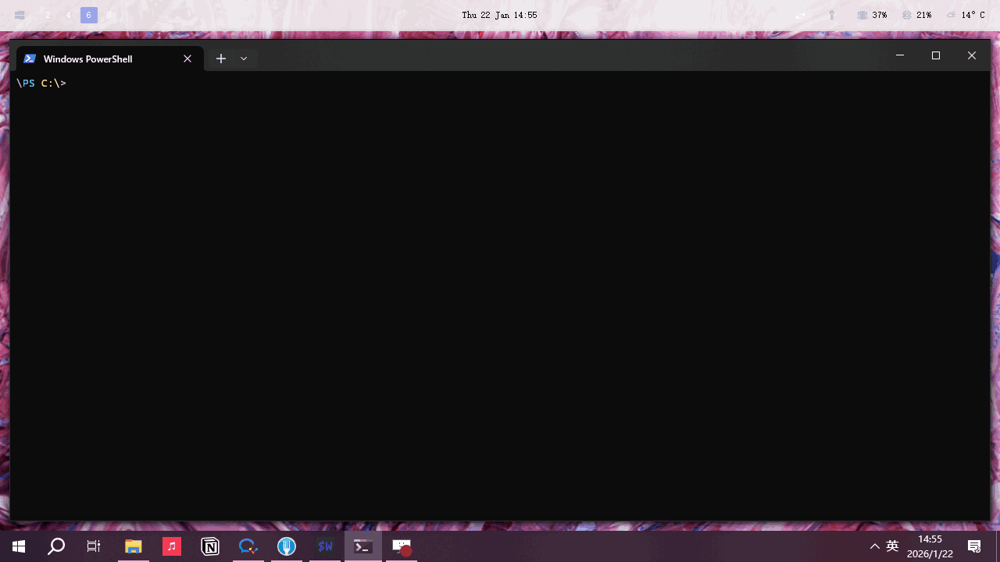

# GlazeFinder

> 🔍 glazeWM 的快速窗口切换工具 | A fuzzy finder window switcher for GlazeWM

使用 [fzf](https://github.com/junegunn/fzf) 的模糊搜索功能，在 [GlazeWM](https://github.com/glzr-io/glazewm) 中快速切换窗口。



## ✨ 功能特性 | Features

- 🚀 **快速搜索** - 瞬间搜索所有窗口和工作区
- 🎯 **精确匹配** - 模糊搜索窗口标题、进程名、工作区名称
- ⌨️ **键盘驱动** - 无缝集成 GlazeWM 的键盘工作流
- 🪶 **轻量级** - 单个 PowerShell 脚本，无额外依赖

## 📋 前置要求 | Prerequisites

在安装 GlazeFinder 之前，请确保已安装：

- **Windows 10/11**
- **PowerShell 5.0 或更高版本** （检查版本：`$PSVersionTable.PSVersion`）
- **[GlazeWM](https://github.com/glzr-io/glazewm)** - Windows 平铺窗口管理器
- **[fzf](https://github.com/junegunn/fzf)** - 命令行模糊搜索工具

### 安装依赖 | Installing Prerequisites

**安装 GlazeWM:**
```powershell
winget install glzr-io.glazewm
```

**安装 fzf:**
```powershell
# 使用 winget
winget install fzf

# 或使用 Chocolatey
choco install fzf

# 或使用 Scoop
scoop install fzf
```

## 🚀 安装 | Installation

### 方法一：快速安装（推荐）

1. **克隆或下载本仓库:**
   ```powershell
   git clone https://github.com/hwei/GlazeFinder.git
   cd GlazeFinder
   ```

2. **运行安装脚本:**
   ```powershell
   .\Install.ps1
   ```

3. **重启 PowerShell 或重新加载配置:**
   ```powershell
   . $PROFILE
   ```

### 方法二：手动安装

1. **下载** `GlazeFinder.ps1` 文件

2. **将文件放置**到你的 PowerShell 脚本目录（例如 `$HOME\Documents\WindowsPowerShell\`）

3. **在 PowerShell 配置文件中添加**（编辑 `$PROFILE`）:
   ```powershell
   # 加载 GlazeFinder
   . "C:\path\to\GlazeFinder.ps1"
   ```

4. **重新加载配置:**
   ```powershell
   . $PROFILE
   ```

## 📖 使用方法 | Usage

### 基本用法

只需在终端输入：
```powershell
gf
```
或完整命令：
```powershell
Find-GlazeWindow
```

### 操作说明

1. 运行命令后，会显示所有窗口列表
2. 使用**方向键**或**输入文字**进行模糊搜索
3. 按 **Enter** 键聚焦选中的窗口
4. 按 **Esc** 键取消

### 显示格式

窗口列表格式如下：
```
[工作区名称] | 进程名称     | 窗口标题
```

### 搜索示例

**搜索 Chrome 窗口：**
```
输入: chrome
```

**按工作区搜索：**
```
输入: workspace-1
```

**按窗口标题搜索：**
```
输入: 文档标题的关键词
```

## ⚙️ 配置 | Configuration

### 自定义 fzf 选项

你可以通过修改脚本中的 fzf 参数来自定义行为。在 `GlazeFinder.ps1` 中找到以下行：

```powershell
} | fzf --reverse `
        --header="Focus Window" `
        --delimiter='\|' `
        --with-nth="1..3"
```

常用的 fzf 选项：
- `--height 40%` - 设置 fzf 窗口高度
- `--layout=reverse-list` - 改变布局
- `--preview='echo {}'` - 添加预览窗口

## 🔧 故障排查 | Troubleshooting

### "GlazeWM is not installed or not in PATH"

确保 GlazeWM 已安装且 `glazewm` 命令在 PATH 中可用。

```powershell
# 测试 glazewm 是否可用
Get-Command glazewm
```

如果未找到，请重新安装 GlazeWM 或检查环境变量。

### "fzf is not installed or not in PATH"

使用前置要求中的方法安装 fzf，然后重启终端。

```powershell
# 测试 fzf 是否可用
Get-Command fzf
```

### "No windows found"

这表示 GlazeWM 当前没有管理的窗口。请确保：
- GlazeWM 正在运行
- 有打开的应用程序窗口
- 窗口已被 GlazeWM 管理（某些系统窗口可能不被管理）

### UTF-8 编码问题

如果看到乱码字符，确保终端支持 UTF-8：
```powershell
[Console]::OutputEncoding = [System.Text.Encoding]::UTF8
```

你也可以将此命令添加到你的 `$PROFILE` 中。

## 🗑️ 卸载 | Uninstallation

运行卸载脚本：
```powershell
.\Uninstall.ps1
```

或手动卸载：
1. 从 `$PROFILE` 中删除 GlazeFinder 相关行
2. 删除 `GlazeFinder.ps1` 文件

## 🤝 贡献 | Contributing

欢迎贡献！请查看 [CONTRIBUTING.md](CONTRIBUTING.md) 了解详细指南。

### 贡献想法 | Ideas for Contributions

- 在 fzf 中添加窗口预览功能
- 支持按工作区或进程过滤
- 为不同窗口状态添加颜色标识
- 与其他窗口管理器集成

## 📄 许可证 | License

MIT License - 详见 [LICENSE](LICENSE) 文件

## 🙏 致谢 | Acknowledgments

- 灵感来源于 ChatGPT 关于 fzf 与 GlazeWM 结合使用的建议
- 感谢 [GlazeWM](https://github.com/glzr-io/glazewm) 社区提供优秀的窗口管理器
- 基于 [fzf](https://github.com/junegunn/fzf) 构建
- 相关项目：
  - [PSFzf](https://github.com/kelleyma49/PSFzf) - PowerShell 的 fzf 包装器
  - [posh-fzf](https://github.com/domsleee/posh-fzf) - PowerShell fzf 集成

## 🔗 相关项目 | Related Projects

- [GlazeWM](https://github.com/glzr-io/glazewm) - Windows 平铺窗口管理器
- [fzf](https://github.com/junegunn/fzf) - 命令行模糊搜索工具
- [PSFzf](https://github.com/kelleyma49/PSFzf) - fzf 的 PowerShell 集成

---

<div align="center">

**用 ❤️ 为 GlazeWM 社区制作 | Made with ❤️ for the GlazeWM community**

如果这个工具对你有帮助，请给个 ⭐️！

</div>
